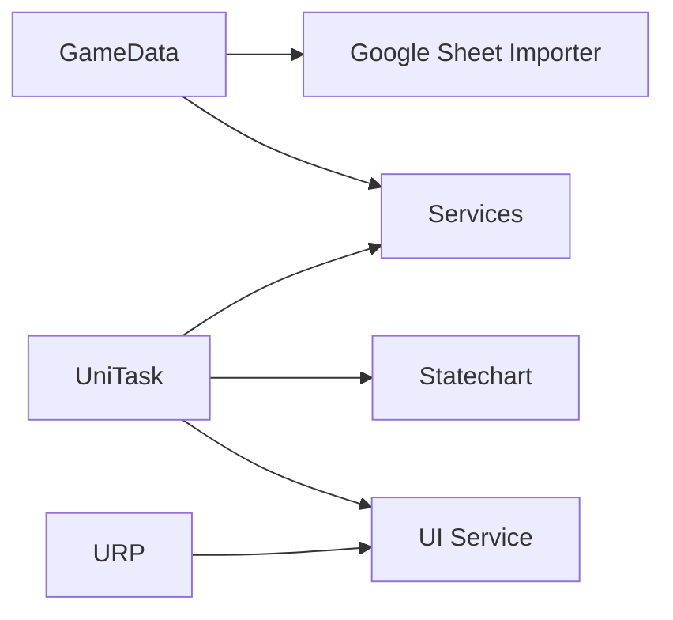

# GameLovers Frameworks

This is the Unity host project for the GameLovers UPM package family. It is a development and validation workspace; each package under `Packages/` is a standalone Git submodule that consumers install independently.

[](https://unity.com/download)

## Choose a package

| Package | Use it for | Unity / pipeline | Repository |
| --- | --- | --- | --- |
| [GameData](Packages/com.gamelovers.gamedata/README.md) | Typed configuration, observables, serialization, deterministic math, and data tools | 6000.0 minimum; pipeline-neutral | [Unity-GameData](https://github.com/CoderGamester/Unity-GameData) |
| [Google Sheet Importer](Packages/com.gamelovers.googlesheetimporter/README.md) | Editor-time import of published Sheets into configuration assets | 6000.0 minimum; pipeline-neutral | [Unity-GoogleSheet-Importer](https://github.com/CoderGamester/Unity-GoogleSheet-Importer) |
| [Services](Packages/com.gamelovers.services/README.md) | Messaging, ticking, pools, persistence, RNG, commands, and Addressables helpers | 6000.0 minimum; pipeline-neutral | [Unity-Services](https://github.com/CoderGamester/Unity-Services) |
| [Statechart](Packages/com.gamelovers.statechart/README.md) | Hierarchical, parallel, and async state machines | 6000.0 minimum; pipeline-neutral | [Statechart-HFSM](https://github.com/CoderGamester/Statechart-HFSM) |
| [Mobile Services](Packages/com.gamelovers.mobileservices/README.md) | Local notifications, native UI, haptics, permissions, deep links, and mobile build tooling | 6000.0 minimum; pipeline-neutral | [Unity-MobileServices](https://github.com/CoderGamester/Unity-MobileServices) |
| [UI Service](Packages/com.gamelovers.uiservice/README.md) | Presenter-based UI orchestration and URP rendering features | 6000.0 minimum; **URP-only** | [Unity-UiService](https://github.com/CoderGamester/Unity-UiService) |



Earlier Configs Provider and Data Extensions functionality is consolidated into GameData. Input Extensions, Native UI, and Notification Service functionality is consolidated into Mobile Services.

## Unity compatibility

All package manifests declare Unity `6000.0` as their minimum compatible editor. The maintained reference streams are `6000.0.x`, `6000.3.x`, and `6000.5.x`; the exact validation editors are `6000.0.81f1`, `6000.3.21f1`, and `6000.5.7f1` (the primary development editor).

These streams are the compatibility target, not a claim that every untested Unity 6 stream is supported. The repeatable validation runner is [Tools/verify-unity-compatibility.sh](Tools/verify-unity-compatibility.sh); its immutable results are the basis for marking individual matrix cells validated.

This host project itself uses Unity `6000.5.7f1` and URP. That host choice does not make the five pipeline-neutral packages URP dependencies.

## Open the host project

```bash
git clone --recurse-submodules <repository-url>
cd Frameworks
```

If you cloned without submodules:

```bash
git submodule update --init --recursive
```

Open the repository root with Unity `6000.5.7f1`. The URP assets of record are under `Assets/Settings/`.

## Test the host

Unity test runs are project-locked and must run serially. With the interactive Editor closed, run:

```bash
Tools/test-all.sh batch
```

For rendering, Addressables, or imported samples, also run the Editor half and inspect the visible result; batchmode does not instantiate URP renderer features.

## Contributing and licensing

Make package changes in the corresponding submodule and keep its README, package manifest, samples, and changelog aligned with the behavior. Licenses are defined per package.
